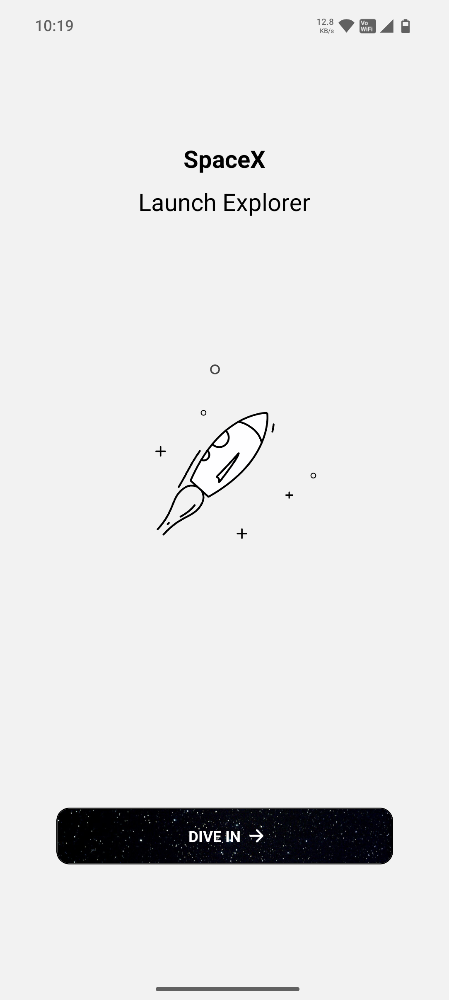
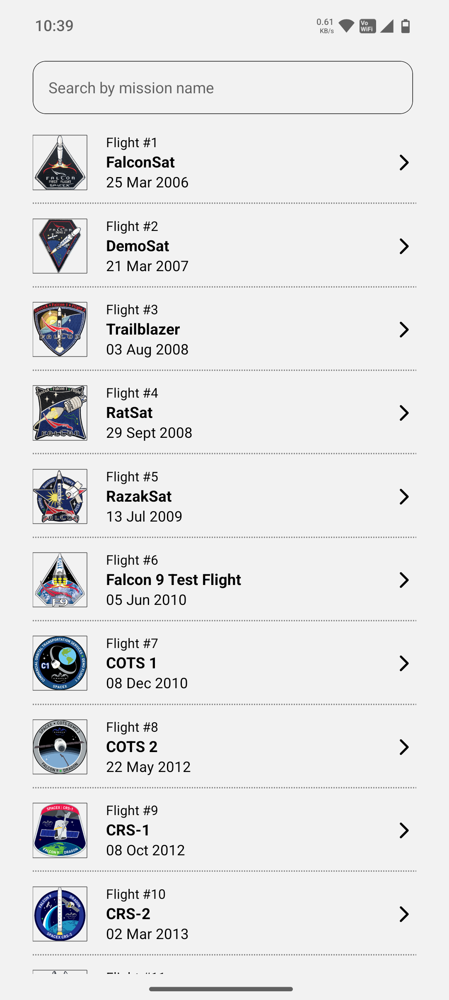
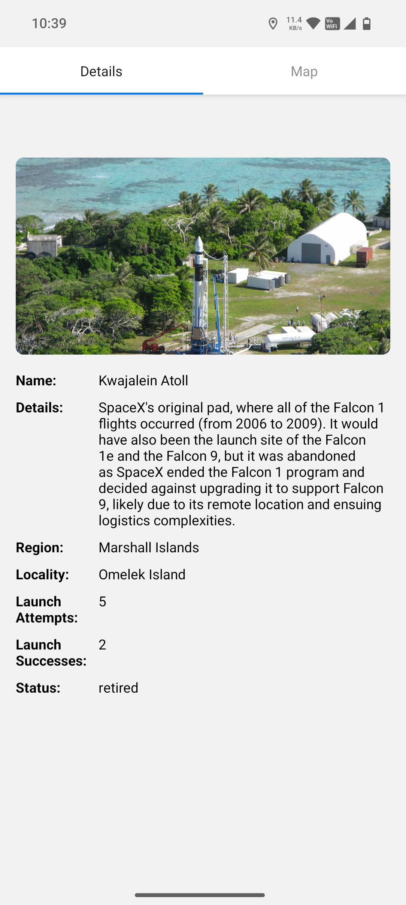
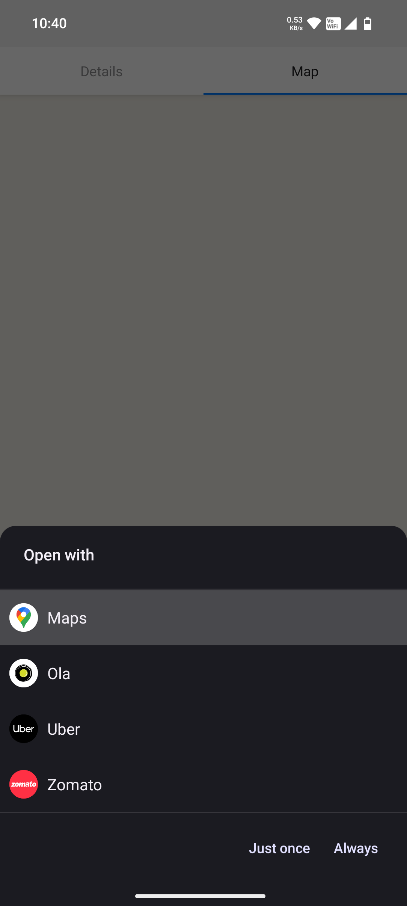

# 🚀 Launch Explorer

A React Native (Expo) app to explore past space launch missions, view their details, and locate their launchpads on an interactive map.

# 📱 Features
- View mission details from API
- Interactive map to visualize launchpad location
- Current user location display
- Permission handling for location access

# 🛠️ Tech Stack
- Expo
- React Native Maps
- Expo Location

## 🛠️ Setup

#Clone repository
- git clone https://github.com/codedbynirmal/spx_launch_explorer.git
- cd spx_launch_explorer

#Install dependencies
- npm install

#Start app
- npx expo start

# 🗺️ Map Implementation

- Uses react-native-maps for displaying maps
- Launchpad coordinates are marked with custom markers

# 🔐 Permissions

- iOS → Adds NSLocationWhenInUseUsageDescription in app.json
- Android → Requests ACCESS_FINE_LOCATION via Expo Location API

# 📷 App Screenshots

 
 
